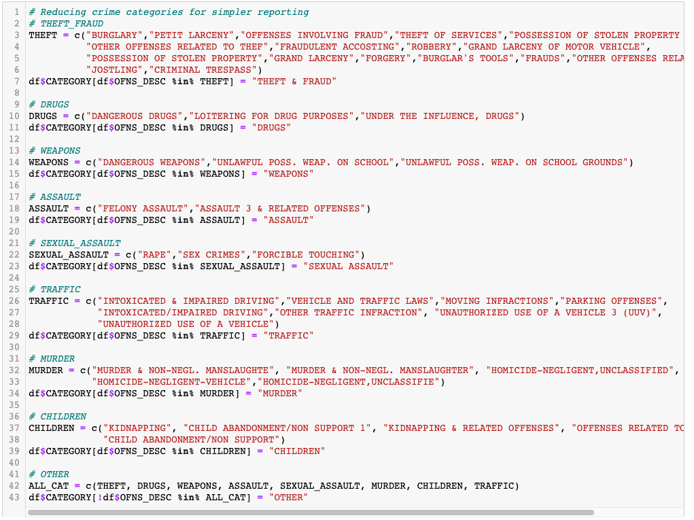
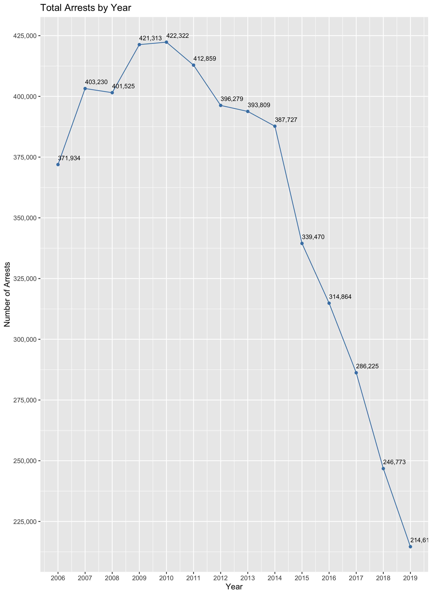
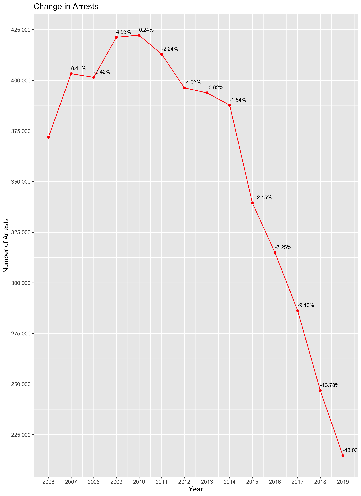

[NYC OpenData](https://data.cityofnewyork.us/Public-Safety/NYPD-Arrests-Data-Historic-/8h9b-rp9u) offers data published by New York City agencies, including the New York City Police Department. This project performs exploratory analysis on NYPD historical valid arrests (those that were not voided due to lack of cause) spanning 14 years from 2006 to 2019, inclusive. I use R, ggplot2 and mongoDB to clean, analyze and persist data.  

# Table of Contents

1. Data Processing
2. Data Analysis & Visualization

# 1. Data Processing

After loading the CSV into a dataframe, we can observe that most of the data types are correct, except for dates. The dates must be properly formated in R. 

Viewing a subset of the dataframe shows us many columns like PD_CD, KY_CD, and OFNS_DESC provide no valuable information. 

In fact, there are 85 distinct values for OFNS_DESC. We can create a new column called CATEGORY to hold much simpler values to identify a category of crime.

With only 9 categories, it becomes easier to analyze the data for practical purposes.

[Home](https://github.com/AmitSamra/NYC_Crime#)

# 2. Data Analysis & Visualization

We begin our analysis of viewing a simple line plot of arrests over time. We can see a sharp increase in arrests starting in 2007, which ultimately peak in 2010, followed by gradual decline until 2014. After 2014, we notice noticeable drop in arrests.

By the end of 2014, arrests had fallen over 12.5%. One possible cause of the reduction in arrests may have been the inauguration of Bill De Blasio as mayor of NYC. According to Wikipedia, ["Exit polls showed that the issue that most aided de Blasio's primary victory was his unequivocal opposition to "stop and frisk"](https://en.wikipedia.org/wiki/Bill_de_Blasio#2013_election).

[Home](https://github.com/AmitSamra/NYC_Crime#)

