[NYC OpenData](https://data.cityofnewyork.us/Public-Safety/NYPD-Arrests-Data-Historic-/8h9b-rp9u) offers data published by New York City agencies, including the New York City Police Department. This project performs exploratory analysis on NYPD historical valid arrests (those that were not voided due to lack of cause) spanning 2015 to 2019, inclusive. I use Python, Socrata, Pandas, R, ggplot2, SQLAlchemy, MySQL and mongoDB to clean, analyze and persist data.  

This repository includes a [Python script](https://github.com/AmitSamra/NYC_Crime/blob/master/nyc_crime_python.py) and accompanying [Jupyter Notebook](https://github.com/AmitSamra/NYC_Crime/blob/master/nyc_crime_python.ipynb), which contain ETL code to acquire data from Socrata's SODA API, clean data and persist data into a MySQL database. The [R script](https://github.com/AmitSamra/NYC_Crime/blob/master/nyc_crime_r.R) and accompanying [Jupter Notebook](https://github.com/AmitSamra/NYC_Crime/blob/master/nyc_crime_r.ipynb) contains code for performing data analysis and creating visualizations using ggplot2. Lastly, a simple demonstration on connecting and persisting the R dataframe into MongoDB follows.

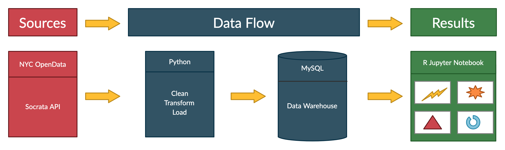

# Table of Contents

1. [Data Processing](https://github.com/AmitSamra/NYC_Crime#1-data-processing)
2. [Data Analysis](https://github.com/AmitSamra/NYC_Crime#2-data-analysis)
3. [NoSQL](https://github.com/AmitSamra/NYC_Crime#3-nosql)

# 1. Data Processing

Data is acquired from the Socrata API using Python.

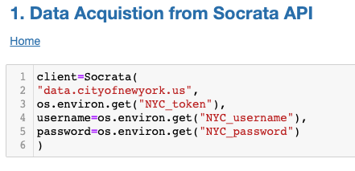

 Python is also used to clean data and ingest it into MySQL. 

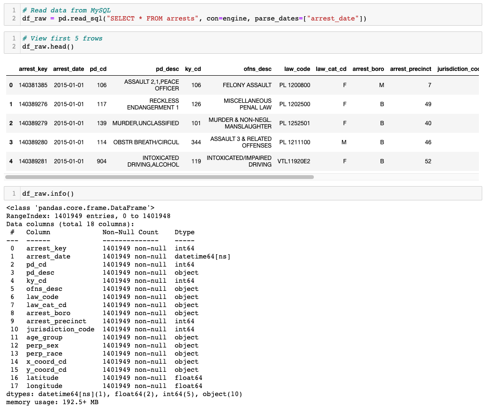

In R, viewing a subset of the dataframe shows us many columns like PD_CD, KY_CD, and OFNS_DESC provide no valuable information. 

Although the data has been cleaned, some transformation must still be made for better analysis. For example, there are 85 distinct values for OFNS_DESC. We can create a new column called CATEGORY to hold much simpler values to identify a category of crime.

With only 9 categories, it becomes easier to analyze the data for practical purposes.

Similarly, we see that there exist numerous age cohorts due to data being entered erroneously. We must replace the incorrect values with "UNKNOWN".

[Home](https://github.com/AmitSamra/NYC_Crime#)

# 2. Data Analysis

We begin our analysis of viewing a simple line plot of arrests over time. We can see a sharp increase in arrests starting in 2007, which ultimately peak in 2010, followed by gradual decline until 2014. After 2014, we notice noticeable drop in arrests.

By the end of 2014, arrests had fallen over 12.5%. One possible cause of the reduction in arrests may have been the inauguration of Bill De Blasio as mayor of NYC. According to Wikipedia, ["Exit polls showed that the issue that most aided de Blasio's primary victory was his unequivocal opposition to "stop and frisk"](https://en.wikipedia.org/wiki/Bill_de_Blasio#2013_election). It is important to note that the reduction in arrests does not imply a reduction in crime. 

Another way of analyzing the trends in arrests over time is viewing a trend line for each year. From this chart we can see a reduction in arrests over time, with 2019 having the lowest number of arrests since 2006. We can also see some seasonality in arrests, which tend to peak in March and October of every year. 

A bar graph of arrests by month shows that arrests occur more in spring and autumn. 

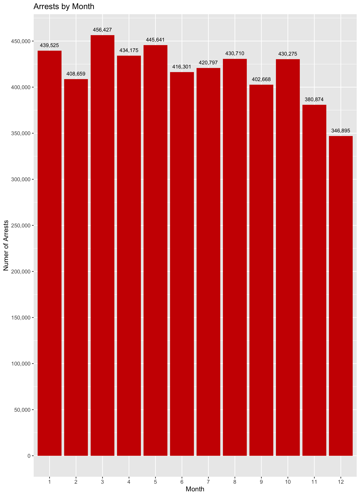

The overwhelming majority of arrests were related misdemeanors followed by felonies. Arrests for lesser crimes like violations and infractions were rare in comparison. 

Using the 9 categories we created, we see that THEFT & FRAUD and DRUGS were the two single largest categories of arrests. 

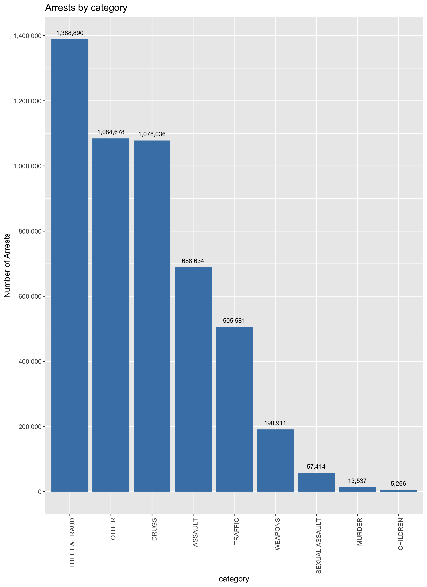

An even more granular view using OFNS_DESC shows that DRUGS were the single largest reason for arrests. 

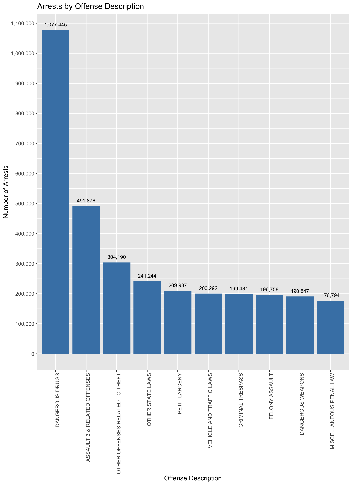

Filtering the data for only drug arrests, we see that arrests for drugs have fallen each since 2011. 

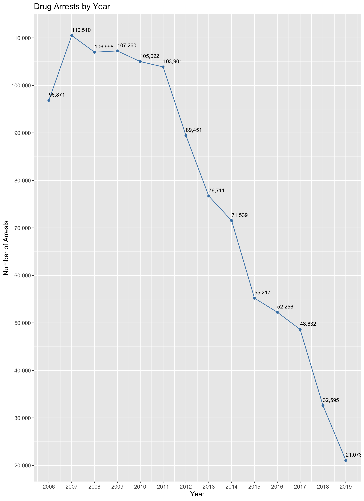

Again, we see a precipitous drop in both 2011 and 2014. 

Brooklyn and Manhattan are the leading boroughs for arrests. 

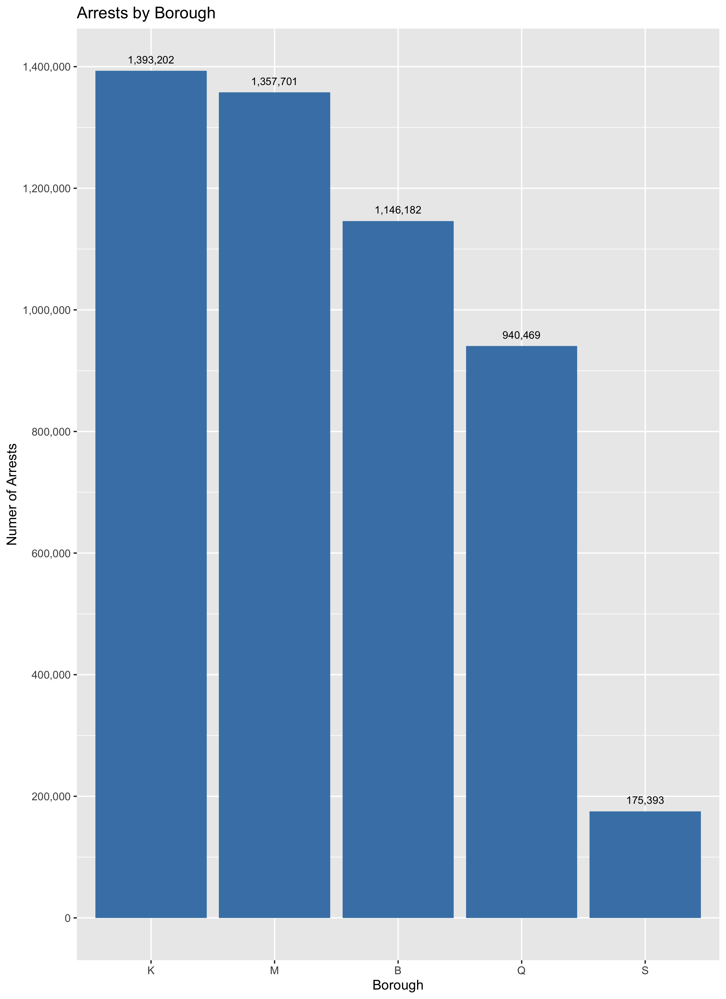

Most arrests occur for the 25-44 age cohort followed by the 18-24 cohort. 

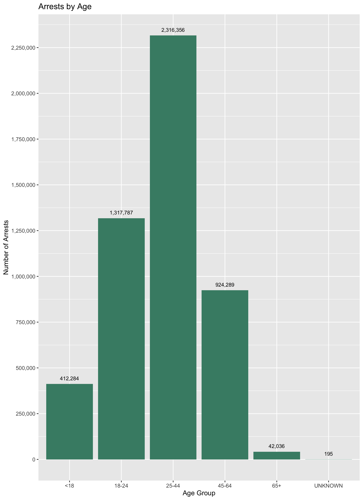

The same trends are true for felony arrests alone. 

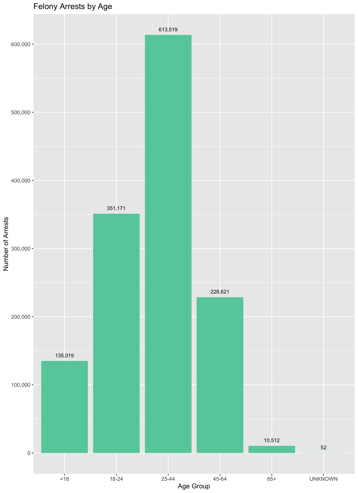

To see the trend more clearly, we can plot the arrests by cohort for all crimes vs. only felonies on the same chart. 

Over 83% of those arrested were men. 

The same trend hold for felony arrests. 

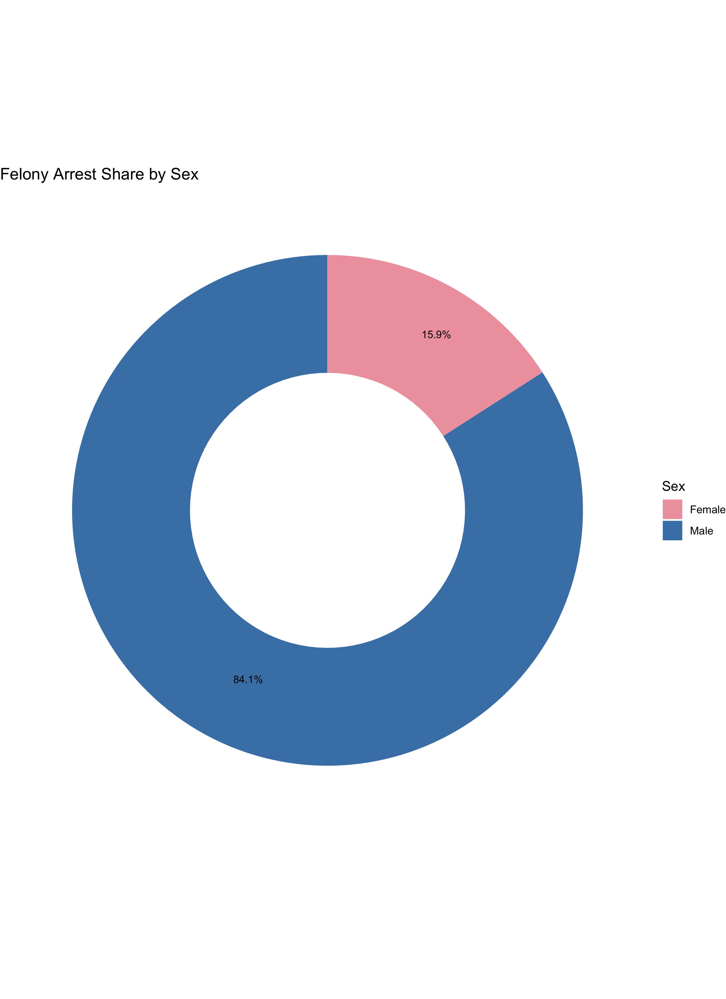

# 3. NoSQL

Although I have already persisted the data into MySQL, for demonstration purposes, I show that NoSQL could have used as well. 

This concludes my presentation. Thank you! 

[Home](https://github.com/AmitSamra/NYC_Crime#)
